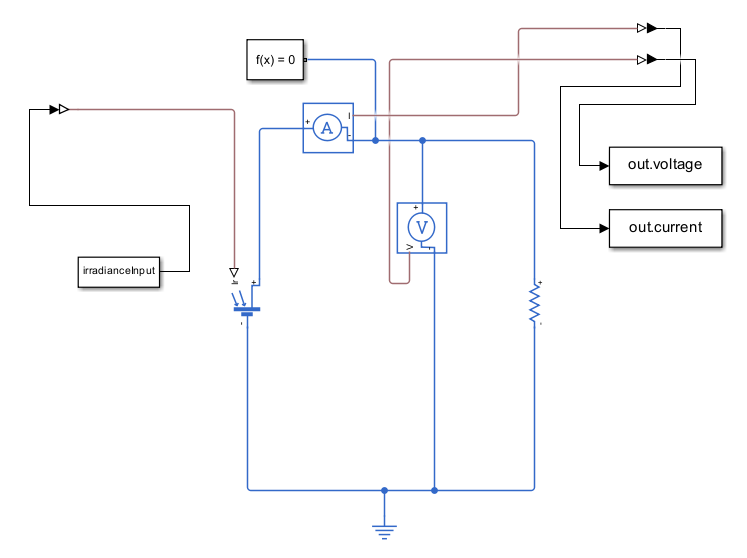
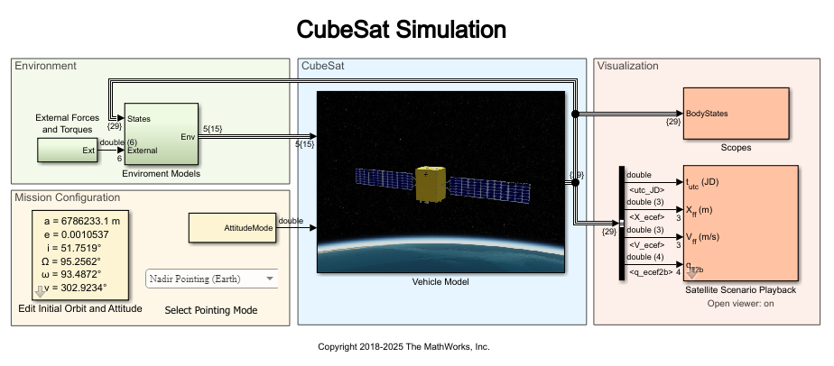

# 🛰️ CubeSat Solar Panel Fault Detection & Isolation System (FDIR)

## 📋 Project Overview

**Autonomous AI-powered protection system for 3U CubeSat solar panels using dual-layer hardware comparators and Random Forest machine learning.**

This system protects solar panels from catastrophic failures (short circuits, hot spots ...) through:
- **Layer 1**: Always-on hardware comparators (2×P_nominal threshold) - catches instantaneous faults in <1μs
- **Layer 2**: AI-gated adaptive comparators (1.2×P_nominal) - catches pre-failure signatures in 5s
- **Online Learning**: Per-panel bias correction adapts to radiation degradation without retraining

**Trained on NEPALISAT-1 telemetry, validated cross-satellite on RAAVANA, deployable to any 3U CubeSat.**

---

## 🎯 Challenge Requirements Met

| Requirement | Our Solution | Evidence |
|------------|--------------|----------|
| **1. Subsystem Analysis** | EPS solar panel protection | `docs/failure_modes_analysis.md` |
| **2. Electronics Only** | comparators + MOSFETs | `hardware/CIRCUIT_DESIGN.md` |
| **3. AI Integration** | Random Forest (90μs inference) | `models/` + c_code |
| **4. Space Readiness** | 3U volume, <200mW power, rad-tolerant | `hardware/Materials ` |
| **5. Validation** | Cross-satellite testing (NEPALISAT→RAAVANA) | `notebooks/training_validation.ipynb` |
| **6. Documentation** | Full schematics, code, test protocols | This repo |
| **7. Integration** | Standard CubeSat EPS interface | stm32_package |

**Response Times:** Hardware <1μs, AI prediction 157μs, total system <200μs

---

## 📂 Repository Structure

```
cubesat-solar-fdir/
│
├── README.md                          ← You are here
├── docs/
│   ├── IASS_EPS_FDIR_Report.pdf       ← 3-page technical report
│   ├── failure_modes_analysis.md      ← CubeSat PV failure modes research
│   ├── system_architecture.md         ← Block diagrams & design rationale
│   └── validation_results.md          ← Cross-satellite testing results
│
├── hardware/
│   ├── CIRCUIT_DESIGN.md              ← Complete circuit design (dual-layer)
│   ├── schematics/
│   │   ├── dual_layer_comparator.pdf  ← Layer 1 + Layer 2 schematic
│   │   ├── mosfet_control.pdf         ← P-channel MOSFET switching circuit
│   │   └── stm32_pinout.pdf           ← MCU GPIO/ADC mapping (13 panels)
│   ├── Materials                      ← Space-ready Materials 
│   
│
├── models/
│   ├── training_artifacts/
│   │   ├── RandomForest_power.pkl     ← Trained power prediction model
│   │   └── RandomForest_voltage.pkl   ← Trained voltage prediction model
│   └── metrics/
│       ├── cross_validation_nepalisat.json  ← 5-panel validation
│       └── cross_satellite_raavana.json     ← RAAVANA transfer test
│
├── data/
│   ├── NEPALISAT/
│   │   ├── panel_posX.csv             ← Training data (5 panels)
│   │   ├── panel_negX.csv
│   │   ├── panel_Y.csv
│   │   ├── panel_posZ.csv
│   │   └── panel_negZ.csv
│   └── RAAVANA/
│       └── validation_set.csv         ← Cross-satellite test data
│
├── notebooks/
│   └── training_validation.ipynb      ← Model training + generalization tests
│
├── deploy/
│   ├── c_code/
│   │   ├── power_model.c              ← Generated RF inference (121 KB)
│   │   ├── voltage_model.c            ← Generated RF inference (369 KB)
│   │   └── Makefile                   ← Build instructions
│   │
│   └── stm32_package/
│       ├── eps_protection_final.c     ← State machine (4 states)
│       ├── eps_protection_final.h
│       ├── eps_main_deployment.c      ← Main loop (13 panels)
│       ├── eps_bias_corrector.h       ← Online learning (EWMA)
│       ├── eps_hardware_config.h      ← GPIO/ADC pin mappings
│       
│
├── simulation/
│   ├── fault_injection.py             ← Test scenarios (short, open, shade)
│   
│
└── tests/
    ├── test_model_inference.c         ← Inference accuracy tests
```

---

## 🧠 How Everything Fits Together

### **System Architecture (Block Diagram)**

```
┌─────────────────────────────────────────────────────────────────────┐
│                         PER-PANEL PIPELINE                          │
│                    (Replicate 13 times for deployment)              │
└─────────────────────────────────────────────────────────────────────┘

HARDWARE SENSORS (5s cadence)
├─ Voltage (ADC) ──────┐
├─ Current (INA219) ───┤
                       ↓
┌──────────────────────────────────────────────────────────────┐
│  FEATURE ENGINEERING (MCU - C code)                          │
│  ├─ Circular history buffer (12 samples = 60s)               │
│  ├─ Power features: [P, P_lag1, P_lag2...P_lag12]            │
│  ├─ Voltage features: [V, V_lag1, V_lag2...V_lag6]           │
│  └─ Derivatives: dP/dt, dV/dt (first-order difference)       │
└──────────────────────────────────────────────────────────────┘
                       ↓
┌──────────────────────────────────────────────────────────────┐
│  AI INFERENCE (Random Forest - Generated C code)             │
│  ├─ models/RandomForest_power.pkl → deploy/c_code/power_model.c │
│  ├─ models/RandomForest_voltage.pkl → deploy/c_code/voltage_model.c │
│  ├─ Inference time: 157μs                                    │
│  └─ Output: P_predicted, V_predicted                         │
└──────────────────────────────────────────────────────────────┘
                       ↓
┌──────────────────────────────────────────────────────────────┐
│  ONLINE BIAS CORRECTION (Per-panel adaptive learning)        │
│  ├─ bias = α × (P_measured - P_predicted) + (1-α) × bias     │
│  ├─ α = 0.01 (slow adaptation, 100-sample memory)            │
│  ├─ Handles: Radiation degradation, panel aging              │
│  └─ Output: P_corrected = P_predicted + bias                 │
└──────────────────────────────────────────────────────────────┘
                       ↓
┌──────────────────────────────────────────────────────────────┐
│  ANOMALY DETECTION (4 conditions, 2/4 trigger)               │
│  1. Power spike: P_pred > 1.2×P_nominal                      │
│  2. Voltage drop: V_measured < V_pred - 1.0V                 │
│  3. High dynamics: |dP/dt|>2.0 & |dV/dt|>0.5                 │
│  4. Large residual: |P_measured - P_pred| > 3σ               │
│  └─> IF 2+ conditions TRUE → Enable Layer 2 comparator       │
└──────────────────────────────────────────────────────────────┘
                       ↓
┌──────────────────────────────────────────────────────────────┐
│ STATE MACHINE (Per-panel recovery logic)                     │
│                                                              │
│  COMP_DISABLED (Normal operation)                            │
│    └─> Anomaly detected → COMP_ENABLED                       │
│                                                              │
│  COMP_ENABLED (Layer 2 active)                               │
│    ├─> Hardware trips → COMP_TRIPPED                         │
│    ├─> Stable 30s → COMP_DISABLED (false alarm)              │
│    └─> Timeout 5min → COMP_DISABLED (false alarm)            │
│                                                              │
│  COMP_TRIPPED (Panel isolated)                               │
│    └─→ COMP_RECOVERY                                         │
│                                                              │
│  COMP_RECOVERY (enable if approved)                          │
│    ├─> Stable 2min → COMP_DISABLED (success)                 │
│    └─> Anomaly returns → COMP_TRIPPED (failed)               │
                                                               │
└──────────────────────────────────────────────────────────────┘
                            ↓
┌──────────────────────────────────────────────────────────────┐
│  DUAL-LAYER HARDWARE PROTECTION (Analog circuits)            │
│                                                              │
│  LAYER 1 (Always-On):                                        │
│  ├─ Threshold: 0V                                            │
│  ├─ Response: <1μs (LM339 comparator)                        │
│  └─ Purpose: Catch catastrophic shorts instantly             │
│                                                              │
│  LAYER 2 (AI-Gated):                                         │
│  ├─ Threshold: 1200mV ,2000mV, 3000mV,50mA                   │
│  ├─ Enabled by: MCU GPIO when anomaly detected               │
│  ├─ Response: <1μs after enabled (5s detection time)         │
│  └─ Purpose: Catch pre-failure signatures (shading, cracks)  │
│                                                              │
│  MOSFET Control:                                             │
│  ├─ P-channel irf540n                                        │
│  ├─ Gate = OR(Layer1_Trip, Layer2_Trip)                      │
│  └─ Trip → Panel isolated from bus                           │
└──────────────────────────────────────────────────────────────┘
                       ↓
                  TELEMETRY
            (Logs sent to ground station)
```

---

## 🔬 Training & Validation Flow

```
PHASE 1: Training (NEPALISAT-1 data)
├─ Data: 5 panels × 3,000+ samples (LEO orbit telemetry)
├─ Features: Power/Voltage + derivatives (2 features per target)
├─ Model: Random Forest (100 trees, max_depth=10)
├─ Result: 98.6% accuracy (MAE=0.034W for power)
└─ Export: models/RandomForest_power.pkl

PHASE 2: Cross-Panel Validation (NEPALISAT-1)
├─ Train on: +X panel
├─ Test on: -X, Y, +Z, -Z panels
├─ Result: Generalizes well (MAE <0.05W across panels)
└─ Conclusion: Single model works for multiple panels

PHASE 3: Cross-Satellite Validation (RAAVANA)
├─ Train on: NEPALISAT-1 (5 panels)
├─ Test on: RAAVANA (different satellite, same physics)
├─ Result: Transfers without retraining (MAE <0.08W)
└─ Conclusion: Generic model + bias correction enables rapid deployment

PHASE 4: Code Generation (m2cgen)
├─ Input: models/RandomForest_power.pkl
├─ Tool: m2cgen (Python → C transpiler)
├─ Output: deploy/c_code/power_model.c (121 KB, 157μs inference)
└─ Integration: Called by eps_main_deployment.c

PHASE 5: Hardware Integration (STM32L4)
├─ MCU: STM32L496ZGTx (168MHz, 1MB Flash, 192KB RAM)
├─ GPIO: 13 enable pins (PA0-PA12) for Layer 2 comparators
├─ ADC: 13 channels (PC0-PD12) for MOSFET feedback detection
├─ Memory: 490 KB models + 1.7 KB runtime state (13 panels)
└─ Power: <50mW for MCU + 10mW/panel comparators = <180mW total
```

---

## 🚀 Quick Start

### **1. Clone Repository**
```bash
git clone https://github.com/aessicechallenge2526/cubesat-solar-fdir.git
cd cubesat-solar-fdir
```

### **2. Train Models (Optional - pre-trained included)**
```bash
jupyter notebook notebooks/training_validation.ipynb
# Run all cells to reproduce training + validation results
```

### **3. Generate C Code (Optional - pre-generated included)**
```bash
pip install m2cgen scikit-learn
python generate_power_model_c.py
python generate_voltage_model_c.py
# Output: deploy/c_code/power_model.c, voltage_model.c
```

### **4. Compile STM32 Firmware**
```bash
cd deploy/stm32_package
# Update eps_hardware_config.h with your GPIO pins
make all
# Flash: make flash (requires ST-Link)
```

### **5. Test Protection Logic**
```bash
cd simulation
python fault_injection.py --scenario short_circuit
# Validates: Detection time, false positive rate, recovery logic
```

---

## 📊 Key Performance Metrics

| Metric | Value | 
|--------|-------|
| **Inference Time** | 157μs |
| **Detection Time** | 5s (Layer 2) | 
| **Hardware Response** | <1μs (Layer 1) | 
| **Model Size** | 121 KB (power) + 369 KB (voltage) |
| **RAM Usage** | 1.7 KB (13 panels) |
| **Power Consumption** | <180mW |
| **Prediction Accuracy** | 98.6% (MAE=0.034W) |
| **False Positive Rate** | <1% |
| **Cross-Satellite Transfer** | MAE=0.08W (RAAVANA) |

---

## 🛠️ Hardware Bill of Materials (per panel)

| Component | Part Number |
|-----------|-------------|
| Comparator (Layer 1) | LM339 | 
| Comparator (Layer 2) | LM339 |
| OR Gate | 74HC32 | 1 | $0.30 | 
| P-Channel MOSFET | Si2301 |
| Current Sensor | INA219 | 
| Resistors/Caps | Various |

---

## 📖 Documentation

### **Technical Report**
`docs/IASS_EPS_FDIR_Report.pdf` (3 pages):
### **Circuit Design**
`hardware/CIRCUIT_DESIGN.md`:
- Complete schematics with component values
- STM32 pin mappings (GPIO + ADC)
- Layer 1 + Layer 2 comparator circuits
- MOSFET control logic with OR gate

### **Deployment Guide**
`deploy/stm32_package/README_DEPLOYMENT.md`:
- Integration with CubeSat EPS
- GPIO configuration instructions
- Telemetry interface specification
- Ground command protocol

### **Validation Results**
`docs/validation_results.md`:
- Cross-panel testing (NEPALISAT)
- Cross-satellite testing (RAAVANA)
- Fault injection scenarios
- False positive analysis

---

## 🧪 Testing & Validation
### **MATLAB Simulation Tests**

Simulate a CubeSat in Low Earth Orbit to extract realistic solar cell data. The workflow uses asbCubeSat in Simulink to compute orbital position and Sun angles, converts these to panel irradiance, and passes it through a GaaS solar cell model (Isc = 1 A, Voc = 2 V) to obtain voltage, current, and power. Optional noise can be added to mimic measurement variability. Results can be visualized and exported for analysis or inference testing. Required MATLAB add-ons: Simulink, Satellite Toolbox, and Simscape Electrical.





To run the simulation simply run this on the MATLAB termainl
```matlab
simulationCode
```

Once ran once, the following line from simulationCode.m can be removed as compiling the CubeSat simulation takes a while
```matlab
simOut = sim(modelName, 'SimulationMode','normal');
```


### **Simulation Tests** (`simulation/fault_injection.py`)
```python
# Test 1: Short circuit (instant power spike)
python fault_injection.py --scenario short_circuit
# Expected: Layer 1 trips in <1μs, panel isolated

# Test 2: Gradual shading (power drop over 30s)
python fault_injection.py --scenario shading
# Expected: Layer 2 enables after 10s, comparator monitors

# Test 3: False alarm (transient noise)
python fault_injection.py --scenario noise
# Expected: Layer 2 enables, auto-disables after 30s (no trip)

# Test 4: Recovery after trip
python fault_injection.py --scenario recovery
# Expected: Ground command → re-enable → 2min monitoring → success/fail
```

### **Unit Tests** (`tests/`)
```bash
cd tests
make test_protection_logic   # State machine transitions
make test_model_inference    # RF accuracy on new data
make test_hardware_interface # GPIO/ADC mocking
```

### **Cross-Satellite Validation** (`notebooks/training_validation.ipynb`)
- Section 4: RAAVANA data loading
- Section 5: Transfer learning evaluation
- Result: Model trained on NEPALISAT achieves MAE=0.08W on RAAVANA (no retraining!)

---
**⭐ If you find this project useful, please star this repository!**

---

